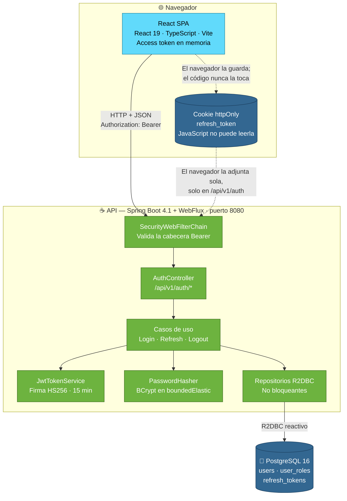

# gestor-accesos

Módulo de seguridad y autenticación de usuarios de un marketplace: registro,
inicio de sesión, gestión de sesiones y control de permisos.

Desarrollado con **SDD (Spec-Driven Development)**: la especificación se
escribe y se aprueba antes que el código. Si el código se desvía de la spec, se
corrige el código o se actualiza la spec de forma explícita — nunca a
posteriori y en silencio.

## Arquitectura

Dos aplicaciones desplegadas por separado, comunicadas solo por HTTP siguiendo
[`specs/api-contract.md`](specs/api-contract.md). No comparten código ni base de
datos.



### Por qué está montado así

**Dos despliegues, no uno.** La SPA es estática y se sirve desde un CDN o un
nginx; la API es un proceso Java. Escalan y se despliegan por separado. En
desarrollo, el proxy de Vite redirige `/api` al backend, así que el navegador ve
un único origen y no hace falta configurar CORS.

**Dos credenciales con responsabilidades distintas.** El access token es un JWT
de 15 minutos que vive **solo en memoria** de la SPA; el refresh token es un
valor opaco de 30 días en una cookie `httpOnly` que JavaScript no puede leer.
Si el access token se guardase en `localStorage`, un XSS lo robaría y todo el
diseño perdería el sentido.

**El backend no guarda estado de sesión en memoria.** El bloqueo de cuentas y
los refresh tokens viven en PostgreSQL, así que se pueden levantar varias
instancias detrás de un balanceador sin sesiones pegajosas, y un reinicio no
borra un bloqueo en curso.

**Nada bloqueante en el hilo de eventos.** Es la regla que impone WebFlux.
BCrypt bloquea unos 100 ms, así que va envuelto en `Schedulers.boundedElastic()`
— el error más común al mezclar Spring Security con WebFlux.

> **Estado real:** hoy solo existen la SPA y la API, comunicadas por
> `/api/v1/status`. Los componentes de autenticación y PostgreSQL están
> especificados pero **sin implementar**; llegan con
> [`specs/login.md`](specs/login.md).

Los diagramas de secuencia del login y de la renovación de sesión están en
[`specs/arquitectura.md`](specs/arquitectura.md).

## Estructura: tres repositorios independientes

Este repositorio contiene **solo la documentación**. El frontend y el backend
viven en repositorios Git separados, con su propio historial:

| Repositorio | Contenido |
| --- | --- |
| [`gestor-accesos`](https://github.com/Sergio-Osorio09/gestor-accesos) | Specs y documentación (este repo) |
| [`gestor-accesos-frontend`](https://github.com/Sergio-Osorio09/gestor-accesos-frontend) | SPA en React + TypeScript + Vite |
| [`gestor-accesos-backend`](https://github.com/Sergio-Osorio09/gestor-accesos-backend) | API en Spring Boot + WebFlux |

**No se usan submódulos.** El repo de specs ignora `frontend/` y `backend/` a
propósito, para que cada equipo trabaje sin pisarse.

## Montar la estructura en local

Clona los tres repos de forma que el frontend y el backend queden **dentro** de
la carpeta de specs:

```bash
git clone https://github.com/Sergio-Osorio09/gestor-accesos.git
cd gestor-accesos

git clone https://github.com/Sergio-Osorio09/gestor-accesos-frontend.git frontend
git clone https://github.com/Sergio-Osorio09/gestor-accesos-backend.git backend
```

El resultado:

```
gestor-accesos/
├── .gitignore          # ignora frontend/ y backend/
├── README.md
├── AGENTS.md           # guía para agentes de IA y personas
├── CLAUDE.md
├── specs/
│   ├── overview.md
│   ├── stack.md
│   ├── api-contract.md
│   ├── arquitectura.md
│   ├── login.md
│   └── login.plan.md
├── frontend/           # repo Git independiente
└── backend/            # repo Git independiente
```

Comprueba que la separación funciona — `git status` en la raíz **no** debe
mencionar `frontend/` ni `backend/`:

```bash
git status
```

> **Importante:** cualquier commit sobre el frontend o el backend se hace
> entrando en su carpeta (`cd frontend && git commit ...`), **nunca desde la
> raíz**.

## Requisitos

| Herramienta | Versión | Comprobar |
| --- | --- | --- |
| Node.js | ≥ 20 | `node --version` |
| JDK | 21 | `javac -version` |
| Git | ≥ 2.30 | `git --version` |

**Yarn no se instala aparte**: se activa con corepack, incluido en Node 20+.

```bash
corepack enable
```

Si `javac` no aparece, tienes solo el JRE. En Debian/Ubuntu:

```bash
sudo apt install openjdk-21-jdk
```

## Arrancar en local

Hacen falta **dos terminales**.

### Backend — puerto 8080

```bash
cd backend
./mvnw spring-boot:run
```

No necesita base de datos: el esqueleto todavía no tiene persistencia. Se
añadirá PostgreSQL al implementar el login.

Comprueba que responde:

```bash
curl http://localhost:8080/api/v1/status
# {"service":"access-manager","status":"UP","apiVersion":"v1","timestamp":"..."}
```

### Frontend — puerto 5173

```bash
cd frontend
yarn install
yarn dev
```

Abre <http://localhost:5173>. La página muestra el estado de la conexión con la
API: en verde si el backend está levantado, en rojo si no.

El servidor de Vite hace de proxy de `/api` hacia `http://localhost:8080`, así
que el navegador ve un único origen y no hay que configurar CORS en
desarrollo.

## Estado actual

Esto es **andamiaje**: los dos proyectos arrancan y se comunican, pero todavía
no hay lógica de negocio.

- ✅ Specs escritas: visión, stack, contrato de API, arquitectura y la primera
  funcionalidad (login).
- ✅ Frontend y backend arrancan y se comunican vía `/api/v1/status`.
- ⬜ Login: especificado en [`specs/login.md`](specs/login.md) y planificado en
  [`specs/login.plan.md`](specs/login.plan.md), **sin implementar**.

## Documentación

Orden de lectura recomendado:

1. [`specs/overview.md`](specs/overview.md) — qué se construye y para quién.
2. [`specs/stack.md`](specs/stack.md) — con qué herramientas y por qué.
3. [`specs/api-contract.md`](specs/api-contract.md) — cómo hablan las dos apps.
4. [`specs/arquitectura.md`](specs/arquitectura.md) — diagramas de componentes.
5. [`specs/login.md`](specs/login.md) — la funcionalidad en curso.

Antes de tocar código, lee [`AGENTS.md`](AGENTS.md): convenciones, reglas de
alcance y cómo trabajar con los tres repositorios.

## Equipo

Equipo de 6 personas. El Product Owner aprueba las specs y resuelve las dudas
de alcance.
