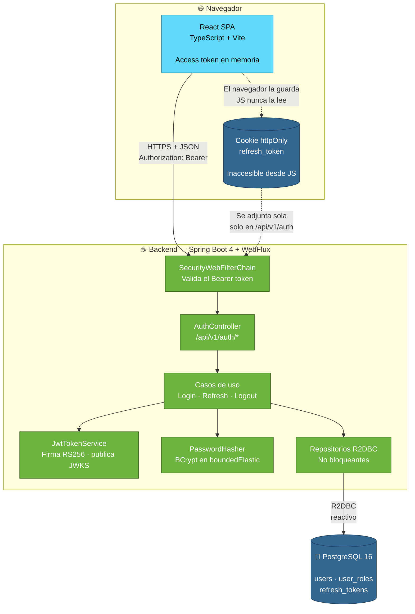
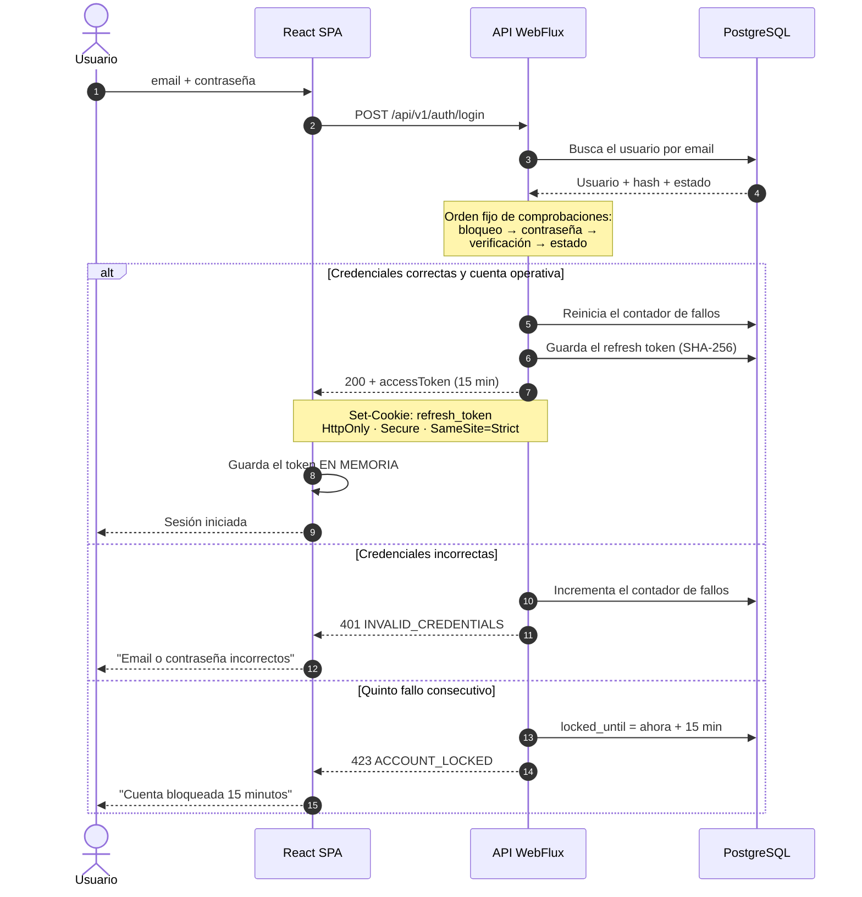
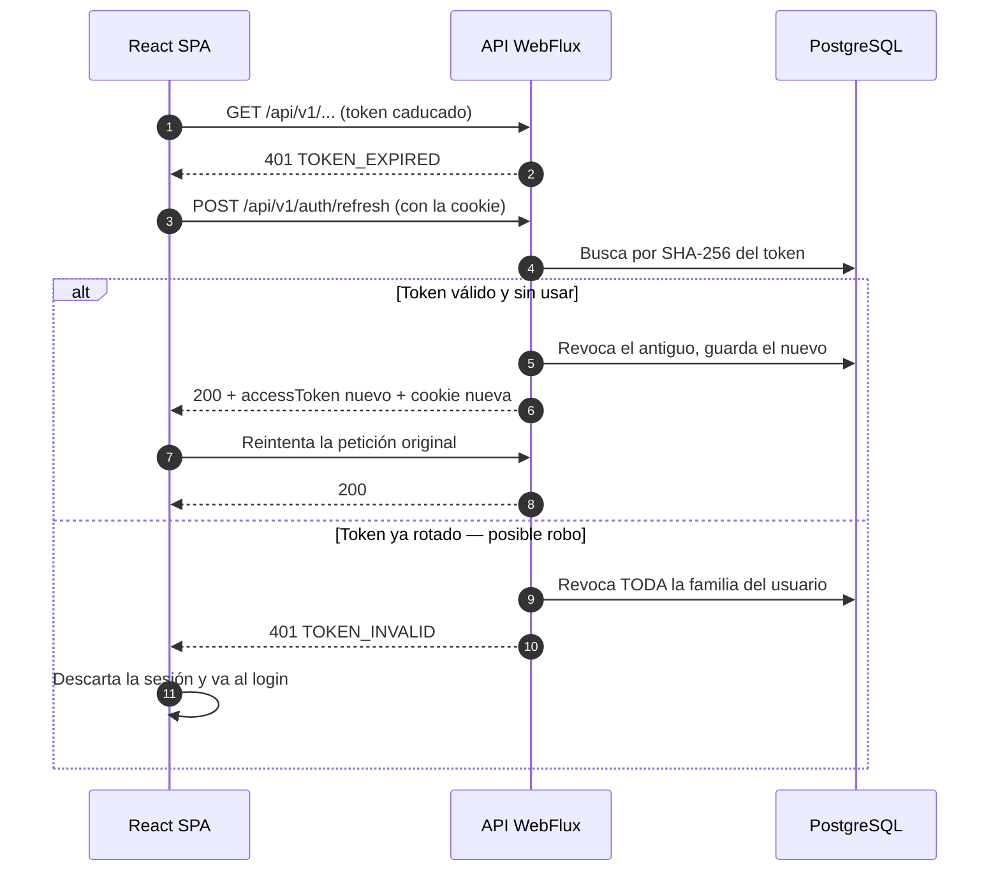
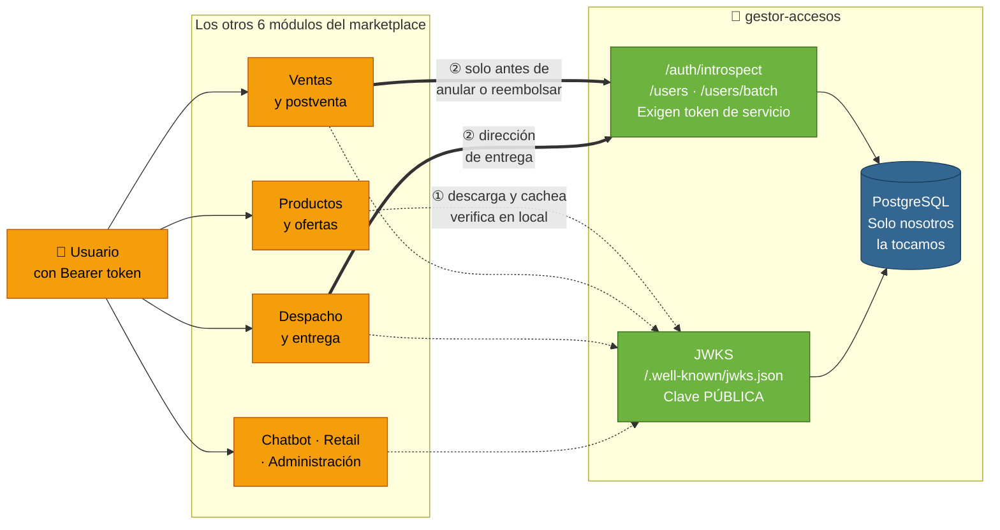

# Arquitectura

## 1. Vista general

Dos aplicaciones desplegadas por separado, comunicadas solo por HTTP siguiendo
[api-contract.md](api-contract.md). No comparten código ni base de datos.

## 2. Flujo de una autenticación

## 3. Renovación transparente de la sesión

Cuando el access token caduca, la SPA lo renueva sin que el usuario se entere:

## 4. Integración con los demás módulos del marketplace

La vista de los apartados anteriores es la del módulo hablando con su propia
SPA. Pero el token que emitimos lo consumen otros seis microservicios, que **no
pueden tocar nuestra base de datos**. Así se relacionan con nosotros:

**La línea punteada ① es el caso normal y no nos llama.** El módulo descarga la
clave pública una vez, la cachea y verifica cada token por su cuenta. Si nuestra
API se cae, los seis módulos siguen autenticando a sus usuarios.

**La línea gruesa ② es la excepción.** Solo antes de operaciones sensibles, o
para datos que el token no lleva. Un módulo que la use en cada petición nos
convierte en su punto único de fallo y anula la ventaja de ①.

El precio de ① está registrado: un token sigue siendo válido hasta su `exp`
aunque el usuario haya sido desactivado. Por eso dura 15 minutos y por eso
existe ②. El detalle completo está en [`integracion.md`](integracion.md).

### Por qué la clave es asimétrica

Si firmáramos con HS256, la única forma de que los seis módulos verificaran sería
darles la clave de firma. Y una clave que verifica también firma: cualquiera de
los seis equipos —o cualquiera que comprometiera a uno de ellos— podría emitir
un token de administrador. Con RS256 reciben la clave **pública**: pueden
comprobar que un token es nuestro, y no pueden fabricar ninguno.

## 5. Decisiones estructurales

**Dos despliegues, no uno.** La SPA es estática (se sirve desde un CDN o un
nginx); la API es un proceso Java. Escalan por separado y se despliegan por
separado. En desarrollo, el proxy de Vite redirige `/api` al backend para
evitar CORS.

**El backend no guarda estado de sesión en memoria.** El bloqueo de cuentas y
los refresh tokens viven en PostgreSQL. Así se puede levantar más de una
instancia detrás de un balanceador sin sesiones pegajosas, y un reinicio no
borra un bloqueo en curso.

**Organización por funcionalidad, no por capa técnica.** El paquete `auth`
contiene su API, sus casos de uso, su dominio y su infraestructura. Con 6
personas trabajando en paralelo, esto reduce los conflictos de merge frente a
un `controllers/` compartido por todos.

**El dominio no conoce a Spring.** Las entidades y los puertos de repositorio
son Java puro; los adaptadores R2DBC implementan esos puertos. Los casos de uso
se prueban sin levantar el contexto de Spring.
